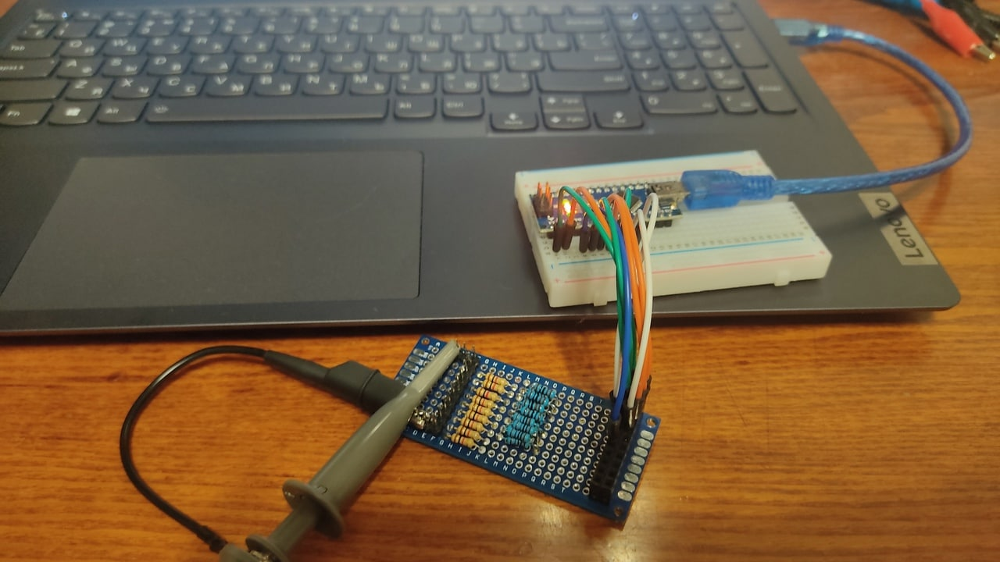
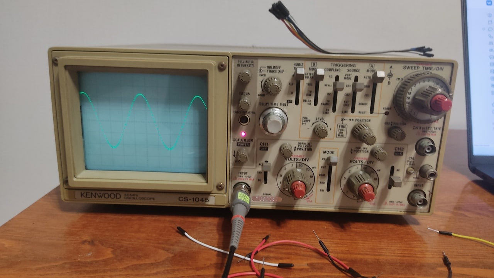
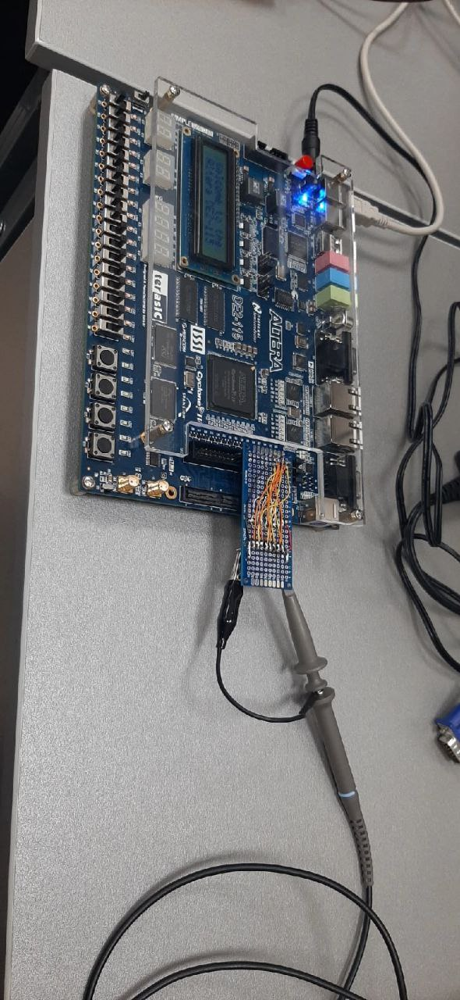
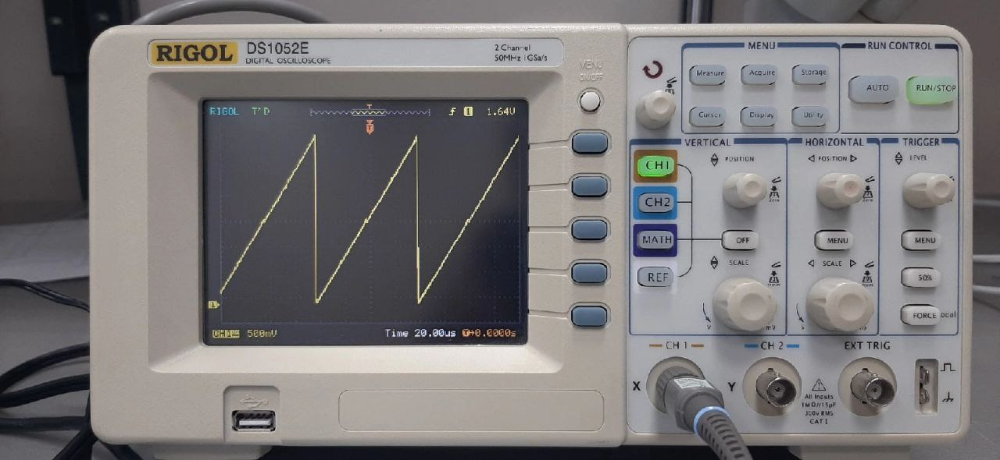
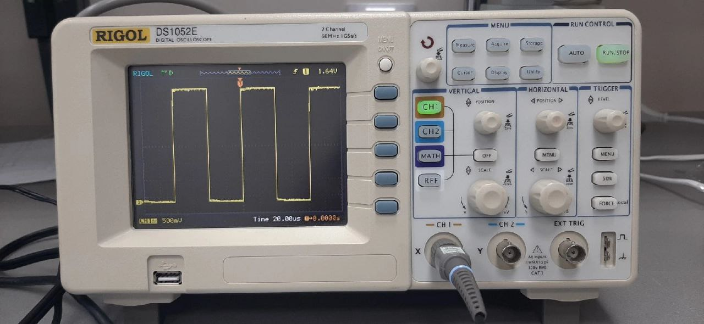
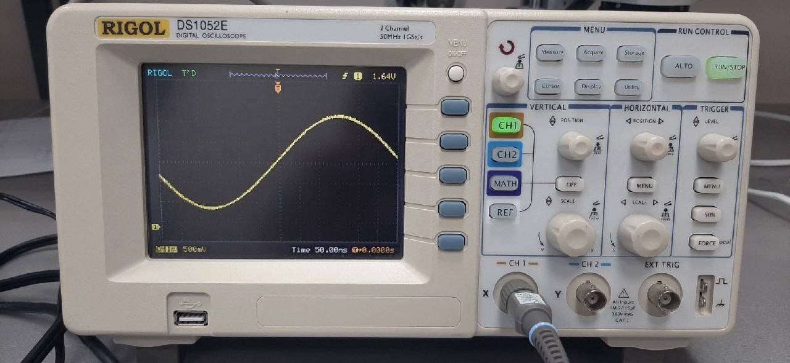
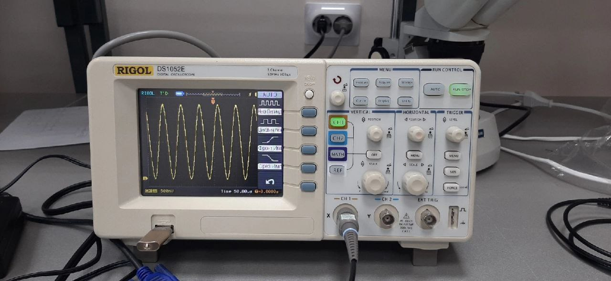

# Генератор сигналов на основе FPGA

Делал проект во время обучения в вузе. Удалось получить синус на частоте в 1.5 МГц. Попутно сделал ЦАП на базе R2R матрицы.

## Тестирование ЦАП дома на ардуинке

*ЦАП*

*Замеры сигнала*

## Тестирование FPGA генератора

*Генератор в сборе*

*Пилообразный сигнал*

*Меандр*

*Синус порядка 1.5 МГц*
